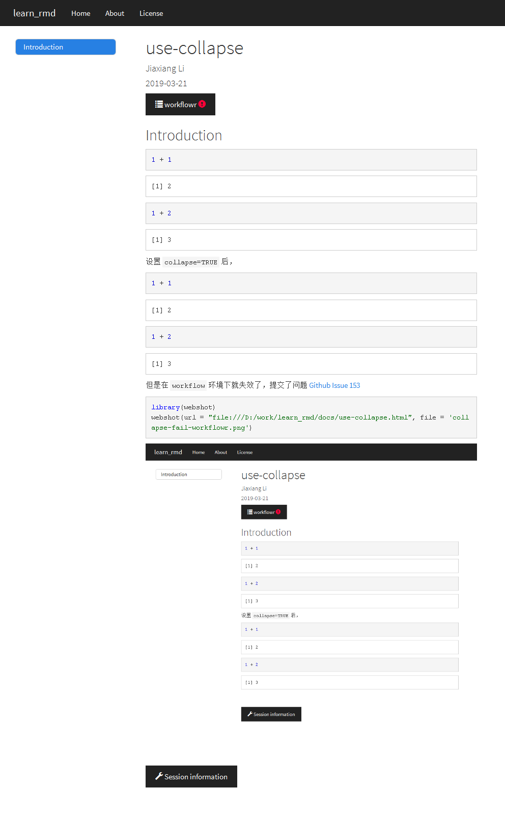

## Skip a line {#skip-a-line}

```
A first sentence
<br><br><br><br>
A seconde sentence
```

A first sentence
<br><br><br><br>
A seconde sentence

## Center an image

```
<center>

</center>
```

只需要略懂`<>`标记语言。

## White space around img

```{r,fig.asp=5}

```

`fig.asp=5` 还不懂。

## Footer and header

```
&nbsp;
<hr />
<p style="text-align: center;">A work by <a href="https://github.com/holtzy/">Yan Holtz</a></p>
<p style="text-align: center;"><span style="color: #808080;"><em>Yan.holtz.data@gmail.com</em></span></p>

<!-- Add icon library -->
<link rel="stylesheet" href="https://cdnjs.cloudflare.com/ajax/libs/font-awesome/4.7.0/css/font-awesome.min.css">

<!-- Add font awesome icons -->
<p style="text-align: center;">
    <a href="https://twitter.com/r_graph_gallery?lang=en" class="fa fa-twitter"></a>
    <a href="https://www.linkedin.com/in/yan-holtz-2477534a/" class="fa fa-linkedin"></a>
    <a href="https://github.com/holtzy/" class="fa fa-github"></a>
</p>

&nbsp;
```

但是会报错

https://github.com/JiaxiangBU/learn_rmd/issues/1

## figures in columns {#figincol}

```{r out.width=c('25%', '25%', '25%', '25%'), fig.show='hold'}
library(magrittr)
boxplot(1:10)
plot(rnorm(10))
plot(rnorm(10))
plot(rnorm(10))
```

https://github.com/JiaxiangBU/learn_rmd/issues/2

## Several columns

感觉比 [figures in columns](#figincol)

<div class = "row">
  
<div class = "col-md-4">
<br><br>Since R Markdown use the [bootstrap framework](https://getbootstrap.com/docs/4.0/layout/grid/) under the hood. It is possible to benefit its powerful grid system. Basically, you can consider that your row is divided in 12 subunits of same width. You can then choose to use only a few of this subunits.
</div>
  
<div class = "col-md-4">
<br><br>Here, I use 3 subunits of size 4 (4x3=12). The last column is used for a plot. You can read more about the grid system [here](bootstrap grid system). I got this result showing the following code in my R Markdown document.
</div>
  
<div class = "col-md-4">
``{r, message=FALSE, echo=FALSE}
ggplot( mtcars, aes(x=mpg)) + geom_histogram(fill="skyblue", alpha=0.5) + theme_minimal()
``
</div>
</div>

```
<div class = "row">
  
<div class = "col-md-4">
<br><br>Since R Markdown use the [bootstrap framework](https://getbootstrap.com/docs/4.0/layout/grid/) under the hood. It is possible to benefit its powerful grid system. Basically, you can consider that your row is divided in 12 subunits of same width. You can then choose to use only a few of this subunits.
</div>
  
<div class = "col-md-4">
<br><br>Here, I use 3 subunits of size 4 (4x3=12). The last column is used for a plot. You can read more about the grid system [here](bootstrap grid system). I got this result showing the following code in my R Markdown document.
</div>
  
<div class = "col-md-4">
``{r, message=FALSE, echo=FALSE}
ggplot( mtcars, aes(x=mpg)) + geom_histogram(fill="skyblue", alpha=0.5) + theme_minimal()
``
</div>
</div>
```

https://github.com/JiaxiangBU/learn_rmd/issues/3

## Hide code

```
output:
  html_document:
    code_folding: "hide"
```

这算是给一个选择。

## Internal link {#inlink}

[Skip a line](#skip-a-line)


## Compile in a website


`_site.yml` 其中的文字

```
name: "my-website"
navbar:
  title: "My Website"
  left:
    - text: "Home"
      href: index.html
    - text: "About"
      href: about.html
```

通过

```{r eval=F}
rmarkdown::render_site()
```

很快的建立了 有nav bar 的网站，workflowr 也是在这个基础上发展的。


